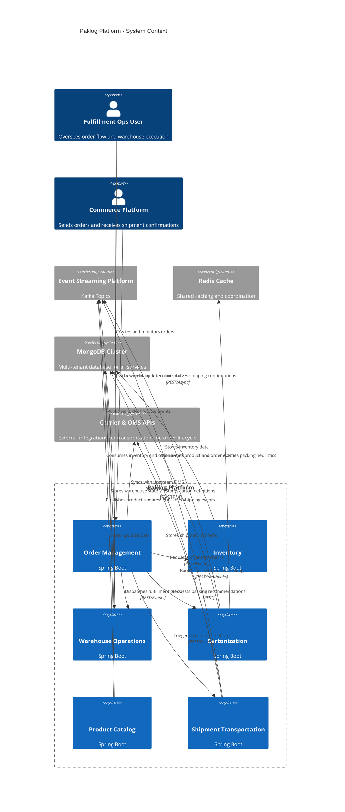

# Paklog Platform - C4 System Context

```mermaid
C4Context
title Paklog Platform - System Context

Person(customer, "Fulfillment Ops User", "Oversees order flow and warehouse execution")
Person(systemInt, "Commerce Platform", "Sends orders and receives shipment confirmations")

System_Boundary(paklog, "Paklog Platform") {
  System(orderMgmt, "Order Management", "Spring Boot", "Tracks fulfillment orders and orchestrates downstream work")
  System(inventorySvc, "Inventory", "Spring Boot", "Maintains stock availability and reservations")
  System(warehouseOps, "Warehouse Operations", "Spring Boot", "Coordinates picking, packing, put-wall, and packing station workflows")
  System(cartonizationSvc, "Cartonization", "Spring Boot", "Calculates optimal carton selections and packing solutions")
  System(productCatalog, "Product Catalog", "Spring Boot", "Stores product details, dimensions, and compliance attributes")
  System(shipmentTransport, "Shipment Transportation", "Spring Boot", "Generates labels, manages carrier events, and tracks deliveries")
}

System_Ext(kafka, "Event Streaming Platform", "Kafka Topics")
System_Ext(redis, "Redis Cache", "Shared caching and coordination")
System_Ext(mongodb, "MongoDB Cluster", "Multi-tenant database for all services")
System_Ext(externals, "Carrier & OMS APIs", "External integrations for transportation and order lifecycle")

Rel(customer, orderMgmt, "Creates and monitors orders")
Rel(customer, warehouseOps, "Tracks warehouse execution state")
Rel(systemInt, orderMgmt, "Sends order updates and receives shipping confirmations", "REST/Async")
Rel(orderMgmt, kafka, "Publishes order lifecycle events")
Rel(orderMgmt, inventorySvc, "Requests inventory checks", "REST/Events")
Rel(orderMgmt, warehouseOps, "Dispatches fulfillment tasks", "REST/Events")
Rel(orderMgmt, cartonizationSvc, "Requests packing recommendations", "REST")
Rel(orderMgmt, shipmentTransport, "Triggers shipment creation", "REST/Events")
Rel(inventorySvc, mongodb, "Stores inventory data")
Rel(warehouseOps, mongodb, "Stores warehouse state")
Rel(cartonizationSvc, mongodb, "Stores carton definitions")
Rel(productCatalog, mongodb, "Stores product data")
Rel(shipmentTransport, mongodb, "Stores shipment artifacts")
Rel(cartonizationSvc, redis, "Caches packing heuristics")
Rel(warehouseOps, kafka, "Consumes inventory and order events")
Rel(cartonizationSvc, kafka, "Consumes product and order events")
Rel(productCatalog, kafka, "Publishes product updates")
Rel(shipmentTransport, kafka, "Publishes shipping events")
Rel(shipmentTransport, externals, "Books carriers, returns tracking", "REST/Webhooks")
Rel(orderMgmt, externals, "Syncs with upstream OMS", "REST/Async")
```
